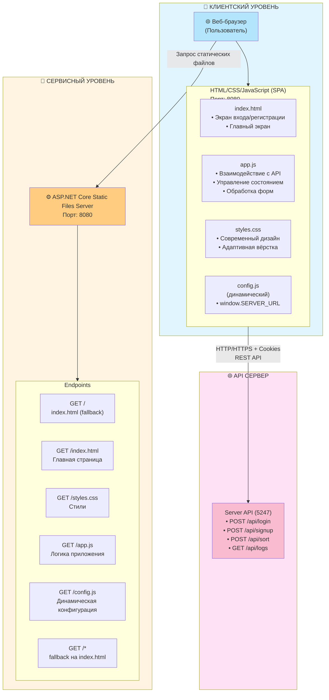
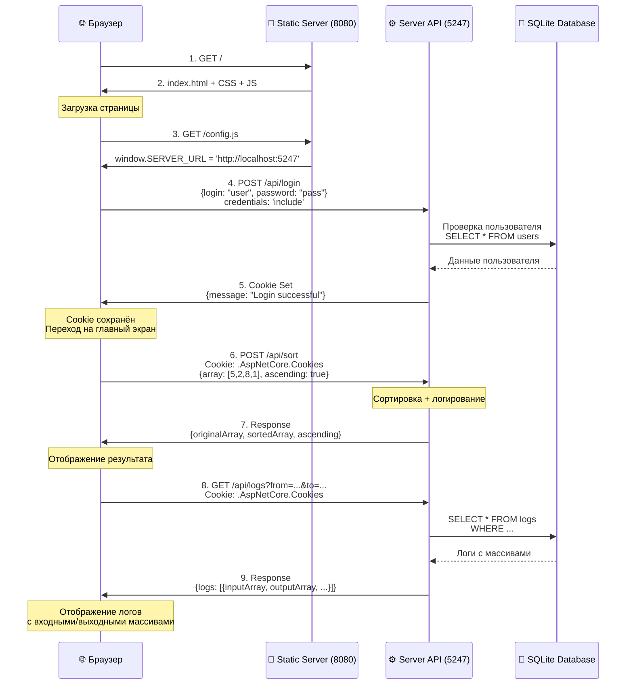

# 🌐 Client - Веб-клиент для сортировки

Веб-клиент представляет собой Single Page Application (SPA) для взаимодействия с API сервера. Предоставляет удобный пользовательский интерфейс для сортировки массивов и просмотра логов.

---

## 📐 Архитектура клиента



---

## 🔄 Поток взаимодействия клиента с сервером



---

## 📁 Структура файлов

```
Client/
├── wwwroot/                    # Статические файлы
│   ├── index.html             # Главная страница SPA
│   ├── styles.css             # Стили интерфейса
│   ├── app.js                 # Логика клиента
│   └── config.js              # Базовый конфиг (переопределяется)
│
├── Program.cs                 # Веб-сервер для раздачи статики
├── Client.csproj              # Файл проекта
├── Dockerfile                 # Docker образ клиента
└── README.md                  # Этот файл
```

---

## 🎨 Пользовательский интерфейс

### Экран входа/регистрации

```
┌─────────────────────────────────────────┐
│     🔧 Сортировка расчёсткой            │
│     Веб-клиент для сервиса сортировки   │
├─────────────────────────────────────────┤
│                                         │
│  [Вход]  [Регистрация]                 │
│  ─────                                  │
│                                         │
│  Вход в систему                         │
│                                         │
│  Логин:     [________________]          │
│                                         │
│  Пароль:    [________________]          │
│                                         │
│           [     Войти     ]             │
│                                         │
└─────────────────────────────────────────┘
```

### Главный экран

```
┌─────────────────────────────────────────────────────────────┐
│  Пользователь: username        [Выйти]                      │
├─────────────────────────────────────────────────────────────┤
│                                                             │
│  ┌──────────────────────┐  ┌────────────────────────────┐  │
│  │ Сортировка массива   │  │ Просмотр логов            │  │
│  ├──────────────────────┤  ├────────────────────────────┤  │
│  │                      │  │                            │  │
│  │ Введите числа:       │  │ Период: [Неделя ▼]        │  │
│  │ [5 2 8 1 9 3]        │  │                            │  │
│  │                      │  │ [Загрузить логи]           │  │
│  │ ○ По возрастанию     │  │                            │  │
│  │ ● По убыванию        │  │ ┌────────────────────────┐│  │
│  │                      │  │ │ [2024-01-15 12:30:00]  ││  │
│  │ [Отсортировать]      │  │ │ [INFO] [user]          ││  │
│  │                      │  │ │ Sorted array (5 elem)  ││  │
│  │ ┌──────────────────┐ │  │ │ Входной: [5,2,8,1,9]  ││  │
│  │ │ Исходный:        │ │  │ │ Выходной: [1,2,5,8,9] ││  │
│  │ │ [5, 2, 8, 1, 9]  │ │  │ └────────────────────────┘│  │
│  │ │                  │ │  │                            │  │
│  │ │ Отсортированный: │ │  │                            │  │
│  │ │ [1, 2, 5, 8, 9]  │ │  │                            │  │
│  │ └──────────────────┘ │  │                            │  │
│  └──────────────────────┘  └────────────────────────────┘  │
│                                                             │
└─────────────────────────────────────────────────────────────┘
```

---

## ⚙️ Конфигурация

### Динамическая конфигурация

Клиент получает URL сервера через динамический endpoint `/config.js`:

```javascript
// Генерируется сервером на основе переменной окружения SERVER_URL
window.SERVER_URL = 'http://localhost:5247';
```

### Переменные окружения

- `CLIENT_PORT` - порт веб-сервера (по умолчанию 8080)
- `CLIENT_HOST` - хост для прослушивания (по умолчанию 0.0.0.0)
- `SERVER_URL` - URL серверного API (используется для генерации config.js)

---

## 🚀 Запуск

### Локально

```bash
cd Client
dotnet restore
dotnet run
```

Клиент будет доступен на `http://localhost:8080`

### Через Docker

```bash
docker-compose up client
```

Или отдельно:

```bash
cd Client
docker build -t sorting-client .
docker run -p 8080:8080 -e SERVER_URL=http://localhost:5247 sorting-client
```

---

## 💻 Функциональность

### Аутентификация

- **Вход:** Ввод логина и пароля, отправка на `/api/login`
- **Регистрация:** Создание нового аккаунта через `/api/signup`
- **Cookie управление:** Автоматическое сохранение и отправка cookies браузером
- **Проверка сессии:** Автоматическая проверка авторизации при загрузке

### Сортировка массива

- **Ввод данных:** Текстовое поле для ввода чисел через пробел
- **Выбор направления:** Радиокнопки для выбора возрастания/убывания
- **Отправка запроса:** POST на `/api/sort` с массивом
- **Отображение результата:** Показ исходного и отсортированного массива

### Просмотр логов

- **Выбор периода:** Выпадающий список (24 часа, неделя, месяц, все)
- **Фильтрация:** Автоматическая фильтрация по выбранному периоду
- **Отображение массивов:** Показ входных и выходных массивов в каждой записи
- **Форматирование:** Цветовая дифференциация по уровням логов

---

## 🎨 Особенности интерфейса

- **Адаптивный дизайн:** Корректное отображение на различных размерах экрана
- **Современный UI:** Градиенты, тени, плавные анимации
- **Цветовая схема:**
  - Уровни логов: INFO (синий), WARNING (жёлтый), ERROR (красный)
  - Выходные массивы выделены зелёным цветом
- **UX улучшения:**
  - Индикаторы загрузки
  - Сообщения об ошибках
  - Успешные операции

---

## 🔧 Технические детали

### Обработка ошибок

- Сетевые ошибки отображаются пользователю
- Ошибки валидации показываются в формах
- Неудачная авторизация отображается отдельным сообщением

### Управление состоянием

- Хранение текущего пользователя в памяти
- Автоматическая проверка авторизации при загрузке
- Переключение между экранами входа и главного экрана

### Cookie handling

- Автоматическая отправка cookies с каждым запросом (`credentials: 'include'`)
- Сохранение cookies браузером после успешной авторизации
- Использование cookies для всех защищённых endpoints

---

## 📝 Основные функции JavaScript

### `checkAuthStatus()`
Проверяет, авторизован ли пользователь, и показывает соответствующий экран.

### `handleLogin()` / `handleSignup()`
Обрабатывает вход и регистрацию пользователя.

### `handleSort()`
Отправляет массив на сортировку и отображает результат.

### `loadLogs()`
Загружает и отображает логи с фильтрацией по периоду.

### `displayLogs()`
Форматирует и отображает логи, включая входные и выходные массивы.

---

## 🛠️ Технологии

- **HTML5** - разметка
- **CSS3** - стили (переменные, градиенты, анимации)
- **JavaScript (ES6+)** - логика приложения
- **Fetch API** - HTTP запросы
- **ASP.NET Core** - веб-сервер для статических файлов

---

## 📖 См. также

- [Главный README](../README.md)
- [README сервера](../Server/README.md)
