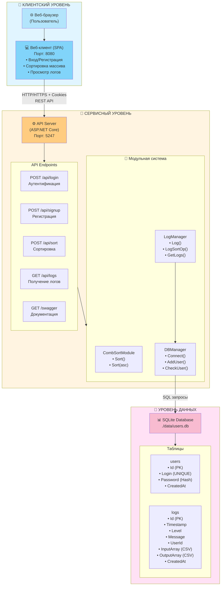
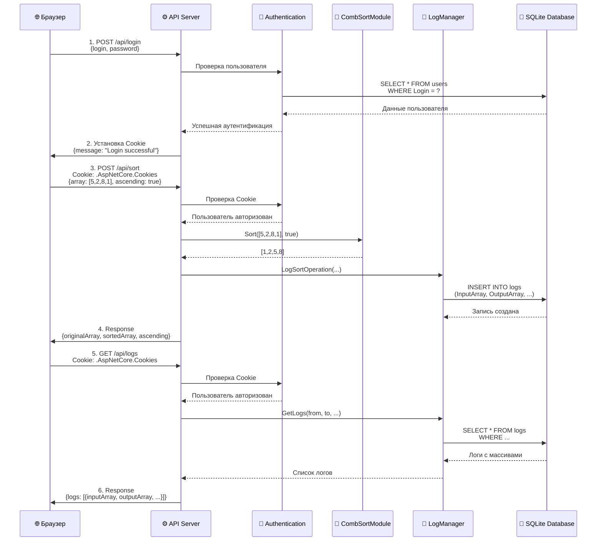
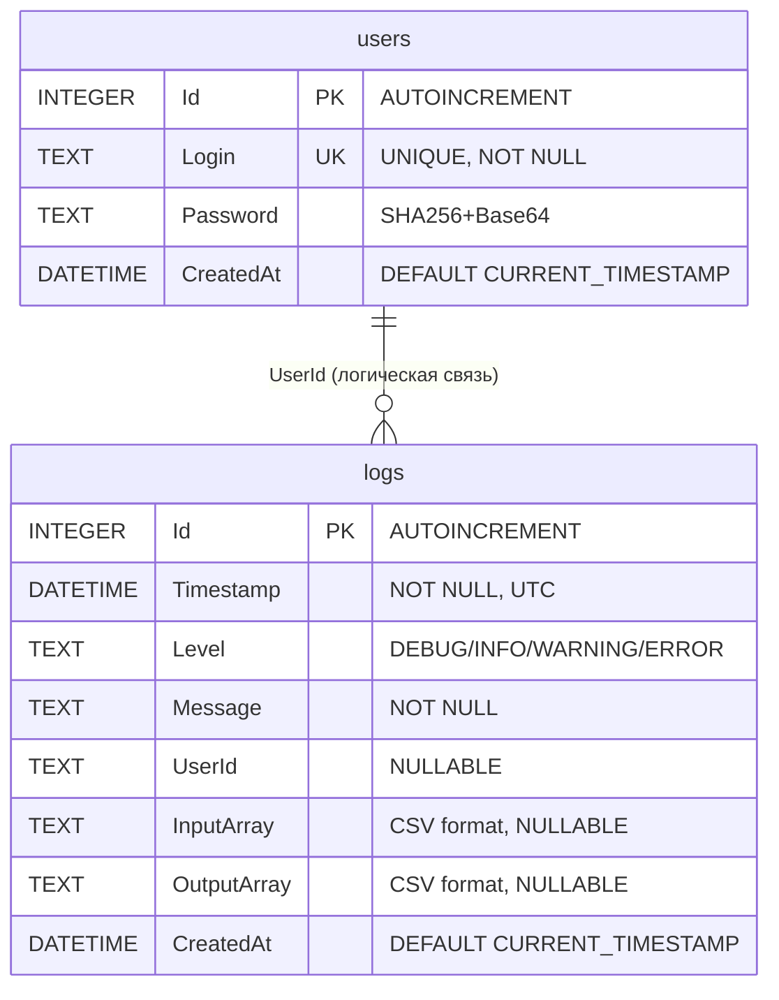

# OP2_2025 — CLI + API для сортировки расчёсткой

Два сервиса: API-сервер и консольный CLI. Сортировка массивов методом расчёстки, логирование, авторизация. Запуск локально или через Docker Compose.

---

## Архитектура (кратко)
- Client (CLI): консоль, общается с API по HTTP, хранит локальные зашифрованные логи.
- Server (API): Minimal API (.NET 8), сортировка расчёсткой, логирование в SQLite, авторизация (cookie).
- DB: SQLite (`./data/users.db`) с таблицами `users`, `logs`.

---

## Структура проекта
```
OP2_2025/
├── Server/           # API
│   ├── Modules/      # Sorting, Logging, Database
│   ├── Program.cs
│   ├── appsettings.json
│   ├── Server.csproj
│   └── Dockerfile
│
├── Client/           # CLI
│   ├── Program.cs
│   ├── Modules/      # Validation, Encryption, HttpClient with retries
│   ├── Client.csproj
│   └── Dockerfile
│
├── docker-compose.yml
├── OP2_2025.sln
└── README.md         # этот файл
```

---

## Возможности
- Сортировка расчёсткой (Comb Sort) с метаданными: шаг, время, время завершения.
- Логи: входные/выходные массивы, уровни логов, фильтры.
- Авторизация: регистрация/вход (cookie).
- Контейнеризация: Docker, Docker Compose.
- Swagger UI для API.
- CLI для работы с API (веб-клиента больше нет).

---

## Быстрый старт

### Docker Compose
```bash
git clone <repository-url>
cd OP2_2025
docker compose up --build
```

После запуска:
- API сервер: `http://localhost:5247`
- Swagger UI: `http://localhost:5247/swagger`
- CLI внутри контейнера: `docker attach sorting-client` (интерактивная консоль)

### Локально
Сервер:
```bash
cd Server
dotnet restore
dotnet run
```

CLI:
```bash
cd Client
dotnet restore
dotnet run
```

---

## Использование (CLI)
1. Запустите клиент (локально или через `docker attach sorting-client`).
2. Войдите или зарегистрируйтесь.
3. Сортировка: введите массив вручную или укажите файл, выберите направление и шаг (или авто).
4. Логи: смотрите локальные сохранённые или серверные (нужна авторизация).
5. Настройки вывода: включить/выключить поля результата (исходный/отсортированный массив, шаг, время, дата завершения).

---

## API (Swagger)
Открыть `http://localhost:5247/swagger` и использовать интерактивную документацию:
- `POST /api/signup` — регистрация
- `POST /api/login` — вход (устанавливает cookie)
- `POST /api/sort` — сортировка (cookie обязательна)
- `GET /api/logs` — логи (cookie обязательна)

---

## Модульная система (Server)
- CombSortModule — сортировка расчёсткой.
- LogManager — логирование в SQLite, хранение входных/выходных массивов.
- DBManager — работа с SQLite, пользователи и логи.

---

## Конфигурация
### Сервер
- `PORT` — порт (по умолчанию 5247)
- `ASPNETCORE_URLS` — `http://0.0.0.0:5247`
- `Database:Path` — путь к БД (`./data/users.db` по умолчанию)

### Клиент (CLI)
- `SERVER_URL` — URL API (по умолчанию `http://localhost:5247`, в Docker — `http://server:5247`)

---

## База данных (SQLite)
- `users`: Id, Login (UNIQUE), Password (SHA256+Base64), CreatedAt.
- `logs`: Id, Timestamp (UTC), Level, Message, UserId, InputArray (CSV), OutputArray (CSV), CreatedAt.

---

## Docker
- `docker-compose.yml` поднимает `server` и `client`.
- Volume `server-data` для хранения SQLite.
- Сеть `sorting-network`.
- Для работы с CLI в контейнере: `docker attach sorting-client`.

---

## Технологии
- .NET 8, ASP.NET Core (Minimal API)
- SQLite
- Docker, Docker Compose
- Swagger / OpenAPI

---

## Лицензия
См. LICENSE в корне репозитория.
# 🔧 OP2_2025 - Система сортировки расчёсткой

Проект предоставляет функционал сортировки массивов методом расчёстки (Comb Sort). Система состоит из двух отдельных сервисов: веб-клиента и API-сервера, которые могут быть запущены как отдельные контейнеры с использованием Docker Compose.

---

## 📐 Архитектура системы



---

## 🔄 Поток запроса сортировки



---

## 🗄️ Схема базы данных



---

## 📁 Структура проекта

```
OP2_2025/
├── Server/                           # Серверное приложение (API)
│   ├── Modules/                     # Модульная система
│   │   ├── Sorting/
│   │   │   └── CombSortModule.cs    # Алгоритм сортировки расчёсткой
│   │   ├── Logging/
│   │   │   └── LogManager.cs        # Управление логами в БД
│   │   └── Database/
│   │       └── DBManager.cs         # Управление БД (SQLite)
│   ├── Program.cs                   # Точка входа и настройка API
│   ├── appsettings.json             # Конфигурация
│   ├── Server.csproj                # Файл проекта
│   ├── Dockerfile                   # Docker образ сервера
│   └── README.md                    # Документация сервера
│
├── Client/                          # Веб-клиент (SPA)
│   ├── wwwroot/                    # Статические файлы
│   │   ├── index.html              # Главная страница
│   │   ├── styles.css              # Стили интерфейса
│   │   ├── app.js                  # Логика клиента
│   │   └── config.js               # Конфигурация (динамическая)
│   ├── Program.cs                  # Веб-сервер для статики
│   ├── Client.csproj               # Файл проекта
│   ├── Dockerfile                  # Docker образ клиента
│   └── README.md                   # Документация клиента
│
├── docker-compose.yml              # Оркестрация сервисов
├── OP2_2025.sln                   # Solution файл
└── README.md                       # Этот файл
```

---

## ✨ Основные возможности

- 🔀 **Сортировка расчёсткой** - эффективный алгоритм сортировки массивов целых чисел
- 🧩 **Модульная архитектура** - сервисы организованы в независимые модули
- 📝 **Система логирования** - логи хранятся в БД с сохранением входных/выходных массивов
- 🔐 **Аутентификация** - система регистрации и входа пользователей через cookies
- 🐳 **Контейнеризация** - полная поддержка Docker и Docker Compose
- 📚 **Swagger UI** - интерактивная документация API
- 🎨 **Современный веб-интерфейс** - адаптивный дизайн для удобной работы

---

## 🚀 Быстрый старт

### Запуск через Docker Compose

```bash
# 1. Клонируйте репозиторий
git clone <repository-url>
cd OP2_2025

# 2. Запустите все сервисы
docker-compose up --build
```

После запуска:
- 🌐 **Веб-клиент**: `http://localhost:8080`
- 🔧 **API сервер**: `http://localhost:5247`
- 📖 **Swagger UI**: `http://localhost:5247/swagger`

### Локальный запуск (без Docker)

#### Сервер

```bash
cd Server
dotnet restore
dotnet run
```

Сервер будет доступен на `http://localhost:5247`

#### Веб-клиент

```bash
cd Client
dotnet restore
dotnet run
```

Клиент будет доступен на `http://localhost:8080`

---

## 📚 Использование

### 🌐 Веб-клиент

1. Откройте браузер и перейдите на `http://localhost:8080`
2. **Вход/Регистрация**:
   - Создайте аккаунт через вкладку "Регистрация"
   - Или войдите через вкладку "Вход"
3. **Сортировка массива**:
   - Введите числа через пробел (например: `5 2 8 1 9 3`)
   - Выберите направление сортировки
   - Нажмите "Отсортировать"
   - Результат отобразится ниже
4. **Просмотр логов**:
   - Выберите период (24 часа, неделя, месяц, все)
   - Нажмите "Загрузить логи"
   - Увидите все операции с входными и выходными массивами

### 📖 Swagger UI - API Документация

1. Откройте `http://localhost:5247/swagger`
2. Просмотрите все доступные endpoints
3. Протестируйте API прямо в браузере:
   - Зарегистрируйтесь через `/api/signup`
   - Войдите через `/api/login` (cookie сохранится автоматически)
   - Используйте защищённые endpoints

---

## 🔌 API Endpoints

### Аутентификация

#### Регистрация
```http
POST /api/signup
Content-Type: application/json

{
  "login": "username",
  "password": "password123"
}
```

#### Вход
```http
POST /api/login
Content-Type: application/json

{
  "login": "username",
  "password": "password123"
}
```
**Ответ:** Устанавливает cookie для последующих запросов

---

### Сортировка

```http
POST /api/sort
Authorization: Required (Cookie)
Content-Type: application/json

{
  "array": [5, 2, 8, 1, 9, 3],
  "ascending": true
}
```

**Ответ:**
```json
{
  "originalArray": [5, 2, 8, 1, 9, 3],
  "sortedArray": [1, 2, 3, 5, 8, 9],
  "ascending": true
}
```

---

### Логи

```http
GET /api/logs?from=2024-01-01T00:00:00Z&to=2024-01-31T23:59:59Z&level=INFO
Authorization: Required (Cookie)
```

**Ответ:**
```json
{
  "count": 10,
  "logs": [
    {
      "timestamp": "2024-01-15T12:30:00Z",
      "level": "INFO",
      "message": "Sorted array (5 elements) | Input: [5,2,8,1,9] | Output: [1,2,5,8,9]",
      "userId": "username",
      "inputArray": [5, 2, 8, 1, 9],
      "outputArray": [1, 2, 5, 8, 9]
    }
  ]
}
```

---

## 🧩 Модульная система

### Модуль сортировки (CombSortModule)

Реализует алгоритм сортировки расчёсткой с коэффициентом сжатия 1.3.

**Методы:**
- `Sort(int[] array)` - сортировка по возрастанию
- `Sort(int[] array, bool ascending)` - сортировка с выбором направления

### Модуль логирования (LogManager)

Хранит логи в базе данных SQLite. Автоматически сохраняет входной и выходной массивы при операциях сортировки.

**Возможности:**
- Запись логов с различными уровнями (DEBUG, INFO, WARNING, ERROR)
- Привязка логов к пользователю
- Хранение массивов (InputArray, OutputArray) в CSV формате
- Получение логов с фильтрацией по дате, уровню, пользователю

### Модуль базы данных (DBManager)

Управляет SQLite базой данных для хранения пользователей и логов.

**Функции:**
- Подключение к БД с автосозданием таблиц
- Управление пользователями (добавление, проверка)
- Хеширование паролей (SHA256 + Base64)
- Предоставление соединения для модуля логирования

---

## ⚙️ Конфигурация

### Переменные окружения

#### Сервер
- `PORT` - порт сервера (по умолчанию 5247)
- `ASPNETCORE_URLS` - URL для прослушивания (по умолчанию `http://0.0.0.0:5247`)
- `Database:Path` - путь к файлу БД (по умолчанию `./data/users.db`)

#### Клиент
- `CLIENT_PORT` - порт веб-клиента (по умолчанию 8080)
- `CLIENT_HOST` - хост для прослушивания (по умолчанию `0.0.0.0`)
- `SERVER_URL` - URL серверного API (по умолчанию `http://localhost:5247`)

### Файл конфигурации (appsettings.json)

```json
{
  "Database": {
    "Path": "./data/users.db"
  },
  "Server": {
    "Port": "5247"
  }
}
```

---

## 🗄️ База данных

### Структура таблиц

#### Таблица `users`
```
┌─────────────┬──────────┬──────────┐
│    Поле     │   Тип    │ Описание │
├─────────────┼──────────┼──────────┤
│ Id          │ INTEGER  │ PK, AI   │
│ Login       │ TEXT     │ UNIQUE   │
│ Password    │ TEXT     │ Hash     │
│ CreatedAt   │ DATETIME │ Default  │
└─────────────┴──────────┴──────────┘
```

#### Таблица `logs`
```
┌─────────────┬──────────┬────────────────────────┐
│    Поле     │   Тип    │      Описание          │
├─────────────┼──────────┼────────────────────────┤
│ Id          │ INTEGER  │ PK, AI                 │
│ Timestamp   │ DATETIME │ UTC время              │
│ Level       │ TEXT     │ DEBUG/INFO/WARNING/ERR │
│ Message     │ TEXT     │ Текст сообщения        │
│ UserId      │ TEXT     │ Имя пользователя       │
│ InputArray  │ TEXT     │ CSV: "1,2,3"           │
│ OutputArray │ TEXT     │ CSV: "1,2,3"           │
│ CreatedAt   │ DATETIME │ Default                │
└─────────────┴──────────┴────────────────────────┘
```

---

## 🐳 Docker

### Volumes

При использовании Docker Compose создаются следующие volumes:

- `server-data` - хранение базы данных SQLite (пользователи + логи)

### Сеть

Все сервисы работают в сети `sorting-network` для безопасного взаимодействия.

---

## 🔧 Разработка

### Структура модулей

```
Server/Modules/
├── Sorting/          # Модуль сортировки
│   └── CombSortModule.cs
├── Logging/          # Модуль логирования
│   └── LogManager.cs
└── Database/         # Модуль базы данных
    └── DBManager.cs
```

### Добавление нового модуля

1. Создайте директорию в `Server/Modules/YourModule/`
2. Реализуйте класс модуля
3. Зарегистрируйте в `Program.cs`:
   ```csharp
   var yourModule = new YourModule();
   builder.Services.AddSingleton(yourModule);
   ```
4. Используйте через dependency injection:
   ```csharp
   app.MapPost("/api/endpoint", ([FromServices] YourModule module) => {
       // Использование модуля
   });
   ```

---

## 🛠️ Технологии

- **.NET 8.0** - основная платформа разработки
- **ASP.NET Core** - веб-фреймворк для API сервера
- **SQLite** - база данных для пользователей и логов
- **Docker & Docker Compose** - контейнеризация и оркестрация
- **Cookie Authentication** - аутентификация пользователей
- **Swagger/OpenAPI** - документация API
- **HTML/CSS/JavaScript** - веб-интерфейс клиента

---

## 📄 Лицензия

См. файл LICENSE

---

## 📖 Дополнительная документация

- [README сервера](Server/README.md) - детальная документация API сервера
- [README клиента](Client/README.md) - документация веб-клиента
