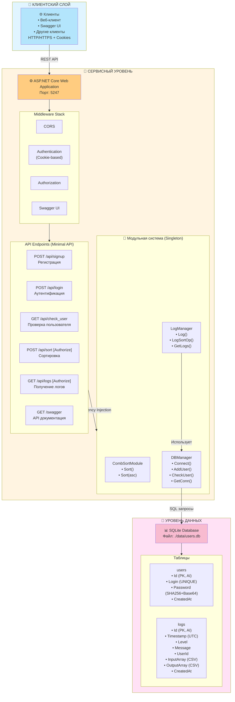
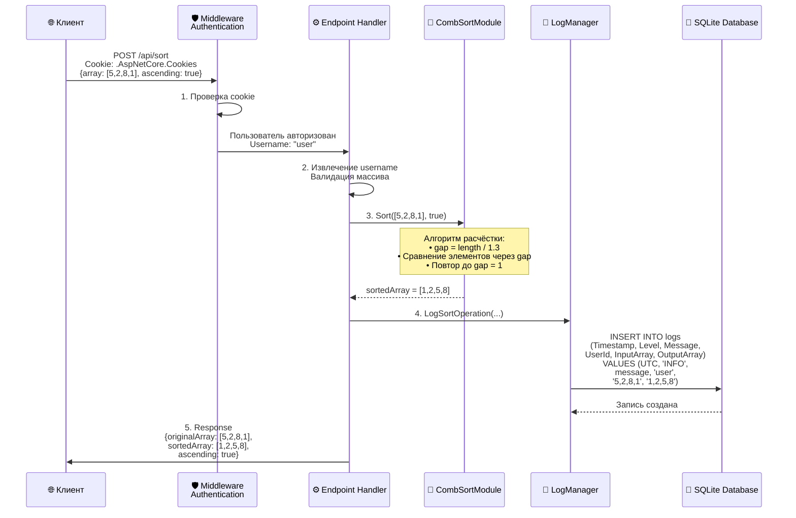
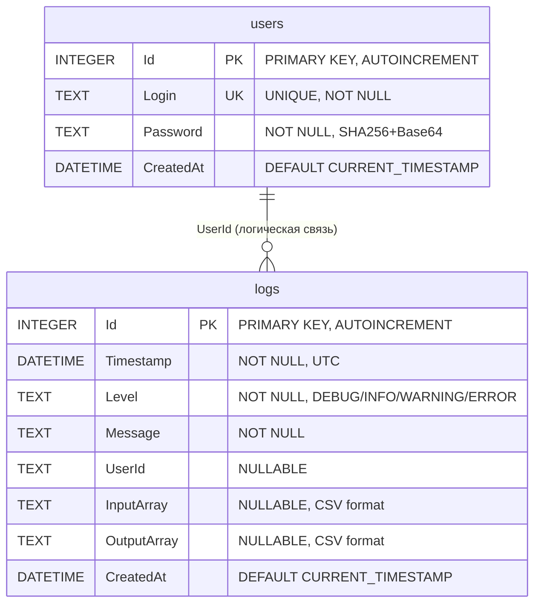

# 🖥️ Server - API сервис сортировки

Серверное приложение предоставляет REST API для сортировки массивов методом расчёстки, управления пользователями и просмотра логов. Все данные хранятся в SQLite базе данных.

---

## 📐 Архитектура сервера



---

## 🔄 Поток обработки запроса сортировки



---

## 📊 Структура базы данных



---

## 🔌 API Endpoints

### Без авторизации

#### `POST /api/signup` - Регистрация

Создаёт нового пользователя в системе.

**Запрос:**
```json
{
  "login": "newuser",
  "password": "securepassword"
}
```

**Ответ (200 OK):**
```json
{
  "message": "User newuser registered successfully!"
}
```

#### `POST /api/login` - Вход в систему

Аутентифицирует пользователя и устанавливает cookie для последующих запросов.

**Запрос:**
```json
{
  "login": "username",
  "password": "password"
}
```

**Ответ (200 OK):**
```json
{
  "message": "Login successful",
  "username": "username"
}
```

**Cookie:** Устанавливается `.AspNetCore.Cookies` для авторизации

---

### С авторизацией (требуется cookie)

#### `POST /api/sort` - Сортировка массива

Сортирует массив методом расчёстки и сохраняет результат в лог.

**Запрос:**
```json
{
  "array": [5, 2, 8, 1, 9, 3],
  "ascending": true
}
```

**Ответ (200 OK):**
```json
{
  "originalArray": [5, 2, 8, 1, 9, 3],
  "sortedArray": [1, 2, 3, 5, 8, 9],
  "ascending": true
}
```

**Логирование:**
- Автоматически сохраняется в таблицу `logs`
- Включает входной и выходной массивы
- Привязывается к текущему пользователю

#### `GET /api/logs` - Получение логов

Возвращает логи с возможностью фильтрации.

**Параметры запроса:**
- `from` (optional) - начальная дата (ISO 8601)
- `to` (optional) - конечная дата (ISO 8601)
- `level` (optional) - уровень лога (DEBUG, INFO, WARNING, ERROR)

**Пример:**
```
GET /api/logs?from=2024-01-01T00:00:00Z&to=2024-01-31T23:59:59Z&level=INFO
```

**Ответ (200 OK):**
```json
{
  "count": 5,
  "logs": [
    {
      "timestamp": "2024-01-15T12:30:00Z",
      "level": "INFO",
      "message": "Sorted array (5 elements) | Input: [5,2,8,1,9] | Output: [1,2,5,8,9]",
      "userId": "username",
      "inputArray": [5, 2, 8, 1, 9],
      "outputArray": [1, 2, 5, 8, 9]
    }
  ]
}
```

#### `GET /api/check_user` - Проверка текущего пользователя

Возвращает имя текущего авторизованного пользователя.

**Ответ (200 OK):**
```json
{
  "username": "username"
}
```

---

## 🧩 Модули

### CombSortModule

**Путь:** `Server/Modules/Sorting/CombSortModule.cs`

Реализует алгоритм сортировки расчёсткой с коэффициентом сжатия 1.3.

**Методы:**

```csharp
// Сортировка по возрастанию
int[] Sort(int[] array)

// Сортировка с выбором направления
int[] Sort(int[] array, bool ascending)
```

**Алгоритм:**
1. Начальный gap = длина массива
2. На каждой итерации gap уменьшается на коэффициент 1.3
3. Сравнение и обмен элементов через gap
4. Повтор до gap = 1 и отсутствия обменов

---

### LogManager

**Путь:** `Server/Modules/Logging/LogManager.cs`

Управляет логированием с хранением в базе данных SQLite.

**Методы:**

```csharp
// Обычное логирование
void Log(LogLevel level, string message, string? userId = null)

// Логирование операции сортировки с массивами
void LogSortOperation(string message, int[] inputArray, int[] outputArray, string? userId = null)

// Получение логов с фильтрацией
List<LogEntry> GetLogs(DateTime? from = null, DateTime? to = null, 
                       LogLevel? level = null, string? userId = null)
```

**Особенности:**
- Автоматическое сохранение входных и выходных массивов
- Фильтрация по дате, уровню, пользователю
- Хранение массивов в CSV формате в БД

---

### DBManager

**Путь:** `Server/Modules/Database/DBManager.cs`

Управляет подключением к SQLite базе данных и операциями с пользователями.

**Методы:**

```csharp
// Подключение к БД
bool ConnectToDB(string path)

// Отключение от БД
void Disconnect()

// Добавление пользователя
bool AddUser(string login, string password)

// Проверка пользователя
bool CheckUser(string login, string password)

// Получение соединения для других модулей
SqliteConnection? GetConnection()
```

**Особенности:**
- Автоматическое создание таблиц при подключении
- Хеширование паролей (SHA256 + Base64)
- Предоставление соединения для LogManager

---

## ⚙️ Конфигурация

### appsettings.json

```json
{
  "Database": {
    "Path": "./data/users.db"
  },
  "Server": {
    "Port": "5247"
  }
}
```

### Переменные окружения

- `PORT` - порт сервера (по умолчанию 5247)
- `ASPNETCORE_URLS` - URL для прослушивания (по умолчанию `http://0.0.0.0:5247`)
- `ASPNETCORE_ENVIRONMENT` - окружение (Development/Production)

### CORS настройки

Разрешены запросы с:
- `http://localhost:8080`
- `http://localhost:3000`
- `http://127.0.0.1:8080`
- `http://127.0.0.1:3000`

Поддерживаются:
- Все HTTP методы
- Все заголовки
- Cookies (credentials)

---

## 🚀 Запуск

### Локально

```bash
cd Server
dotnet restore
dotnet run
```

Сервер будет доступен на `http://localhost:5247`

### Через Docker

```bash
docker-compose up server
```

Или отдельно:

```bash
cd Server
docker build -t sorting-server .
docker run -p 5247:5247 -v server-data:/app/data sorting-server
```

---

## 🔍 Swagger UI

После запуска сервера откройте:

```
http://localhost:5247/swagger
```

Swagger UI предоставляет:
- Интерактивную документацию всех endpoints
- Возможность тестирования API прямо в браузере
- Описание моделей запросов и ответов
- Поддержку cookie authentication

---

## 📝 Логирование

### Уровни логирования

- **DEBUG** - отладочная информация
- **INFO** - информационные сообщения (операции сортировки)
- **WARNING** - предупреждения (пустой массив, неудачная регистрация)
- **ERROR** - ошибки (ошибки подключения к БД, исключения)

### Формат записи в БД

При операции сортировки сохраняется:
- Временная метка (UTC)
- Уровень (INFO)
- Сообщение с описанием операции
- Имя пользователя
- Входной массив (CSV)
- Выходной массив (CSV)

---

## 🔒 Безопасность

- **Хеширование паролей:** SHA256 + Base64
- **Cookie Authentication:** безопасная передача авторизации
- **CORS:** ограниченный список разрешённых источников
- **Валидация данных:** проверка входных параметров
- **SQL Injection защита:** использование параметризованных запросов

---

## 🛠️ Технологии

- **.NET 8.0** - платформа
- **ASP.NET Core** - веб-фреймворк
- **SQLite** - база данных
- **Swashbuckle.AspNetCore** - Swagger/OpenAPI
- **Microsoft.Data.Sqlite** - драйвер БД

---

## 📖 См. также

- [Главный README](../README.md)
- [README клиента](../Client/README.md)
